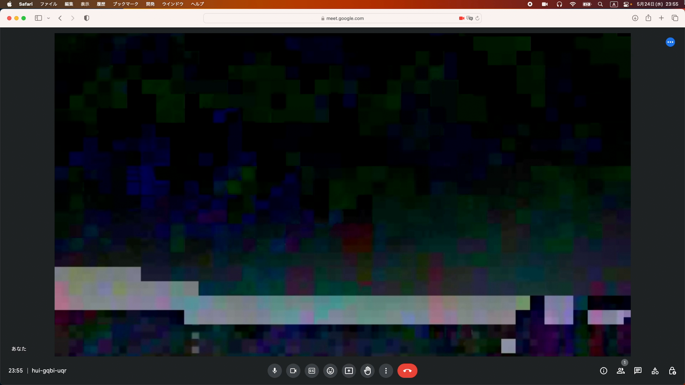

```
$ mv /Users/mizt/Downloads/20230524-main/RDM.app /Applications
$ open /Applications/RDM.app
```

#### References

[CoreMediaIOのCamera ExtensionでmacOSの仮想カメラを作る](https://qiita.com/fuziki/items/405c681a0cae702ad092)  
[CIFilterCam](https://github.com/noppefoxwolf/CIFilterCam)
